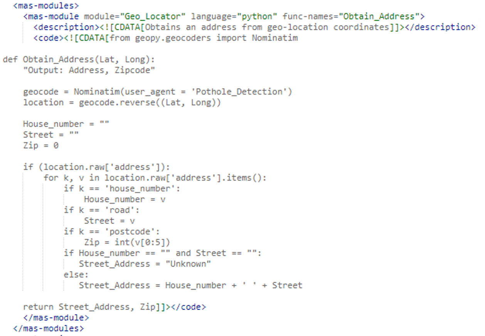
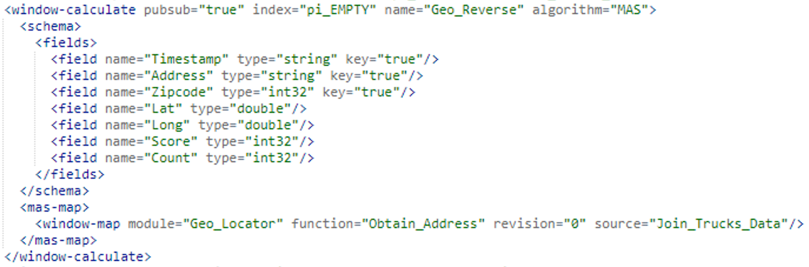
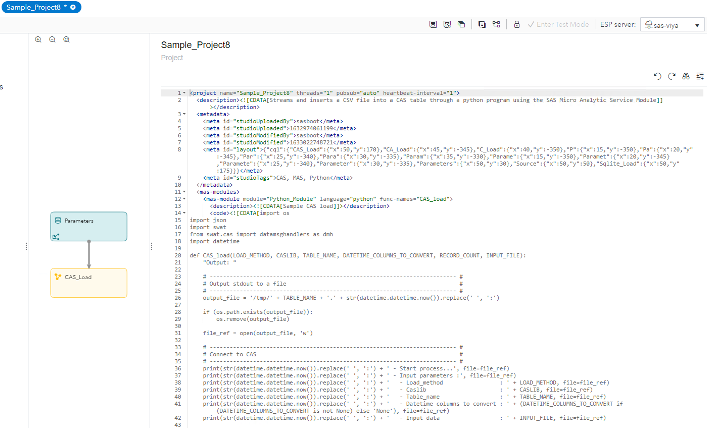
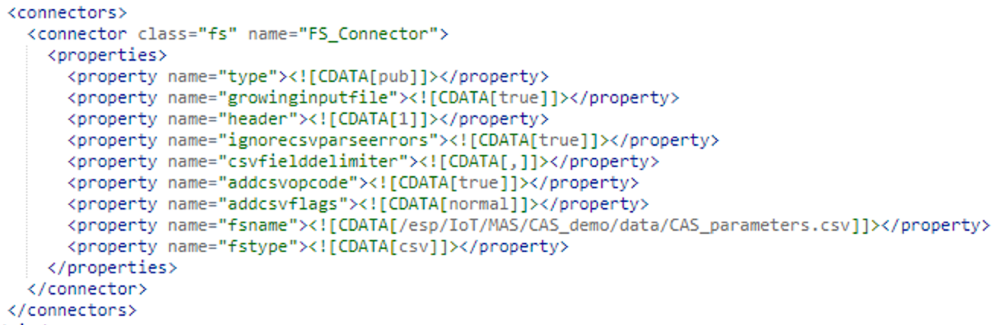
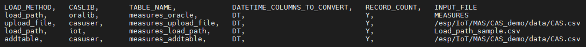
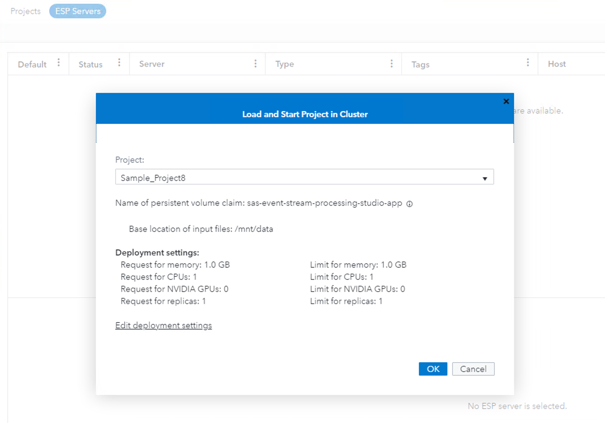
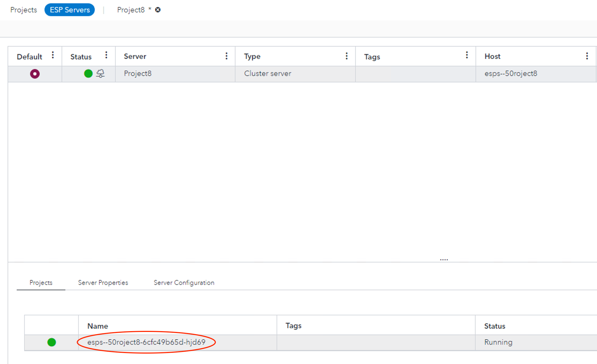
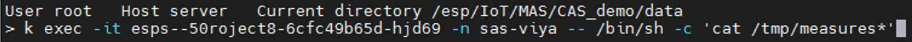
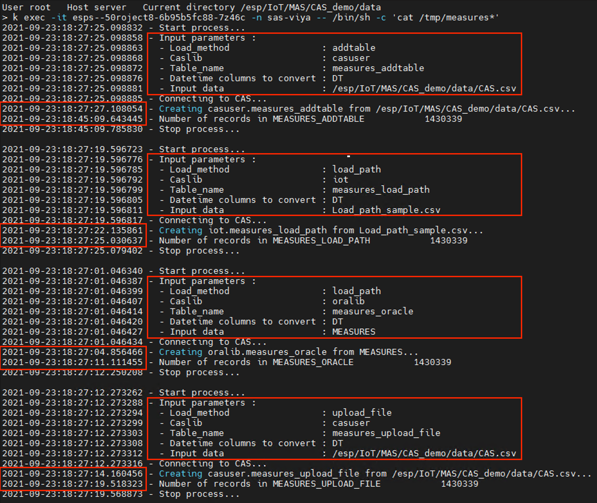

# Ingesting data into CAS using the SAS Micro Analytic Service (MAS) [DEPRECATED]

## DEPRECATION NOTICE
As of the 2020.1 release, SAS® Event Stream Processing no longer supports the loadStreams and espCluster action sets. This github repository has been deprecated and will no longer be updated.

---

A tutorial that shows how the SAS Micro Analytic Service (MAS) can be used to ingest data into CAS.

## Table of Contents

* [Overview](#overview)
	* [Prerequisites](#prerequisites)
	* [What is MAS?](#what-is-mas)
	* [How do I use MAS in an ESP project?](#how-do-i-use-mas-in-an-esp-project)
* [Getting Started](#getting-started)
	* [Load Methods](#load-methods)
	* [Running the project](#running-the-project)
	* [Troubleshooting](#troubleshooting)
* [Conclusion](#conclusion)
* [Contributing](#contributing)
* [License](#license)
* [Additional Resources](#additional-resources)

## Overview

A SAS ESP data stream can be stored in a CAS table in a couple different ways:

- Through the CAS Adapter (with Viya4, available only on secure environments)
- Programmatically, via the **loadStream** CAS actionset (with Viya4, available only on unsecure environments)

This tutorial illustrates an additional techinique based on **Python** and the SAS Micro Analytic Service.

### Prerequisites

On a standard Viya4 installation, MAS comes with its own internal Python deployment characterized by a limited number of packages. The ingestion of a data stream into CAS necessitates for Python to have access to the SAS SWAT package. Since the internal Python deployment is read-only, a patch is required for the Kubernetes MAS deployment to override the default Python installation. The implementation of the patch as well as the installation of the SAS SWAT package are beyond the scope of this tutorial. The ESP project as well as the data used in this entry can be found inside the [Demo data](Demo Data) folder.

### What is MAS?

A memory-resident, high-performance program execution service, the SAS Micro Analytic Service is multi-threaded and can be clustered for high availability. It can host multiple programs simultaneously, as well as multiple user or business contexts that are isolated from one another. It provides hosting for **DS2** and **Python** programs and supports a “compile-once, execute-many-times” usage pattern.

SAS Micro Analytic Service contains a core engine that is written in C for high performance and, when deployed as part of SAS® Event Stream Processing, includes **C++** classes that integrate with SAS Event Stream Processing. These capabilities allow both to execute within the same process space for maximum performance. The combination of SAS Event Stream Processing and SAS Micro Analytic Service enables SAS analytics, business logic, and user-written programs to operate on streams of data in motion.

### How do I use MAS in an ESP project?

MAS modules are embedded in an ESP project using the <b>\<mas-modules\></b> and <b>\</mas-modules\></b> XML tags. A project can specify more than one module. Each module has to be embedded between its <b>\<mas-module\></b> and <b>\</mas-module\></b> XML tags. MAS modules are generally defined at the top of the project, between the <b>\<metadata\></b> and the <b>\<contqueries\></b> tags. Here is an example of a MAS module written in Python:

In this example, the name of the module is **Geo_Locator**, and its associated function is called **Obtain_Address**. These two pieces of information are required to run the module. If multiple cascading functions are present, make note of the name of the main function that calls the others, as that function will be used as an input parameter in the window that invokes the MAS module. The **Obtain_Address** function requires two arguments, **Lat**, and **Long**, which are passed (for each record being processed) by the window that invokes the MAS module. Another important aspect is represented by the **"Output: \<var1\> ,\<var2\>,... \<varN\>"** statement. This statement determines whether the main function returns any values to a window, along with the name of the variables that store them. The notation must be specified even when a function doesn't return a value. In that case the statement will simply read **"Output: "**. For demo purposes, it's also noticeable how the name of the output parameters for the **Obtain_Address** function doesn't match the name of the variables the module returns to the invoking window. They don't need to be the same, even though identical names can be used. Whatever the choice, the names specified in the **"Output: "** statement will be the ones seen by the invoking window, so care must be excercised when handling the output of a MAS module call.
The following image shows how the MAS module is invoked:

The list of fields specified comes from the "Join_Trucks_Data" window, and includes **Lat** and **Long**, which are the two variables that are passed to the **Obtain_Address** function. It's useful to point out that the function doesn't need to read in all variables from the invoking window in order to preserve their value. The ones "not needed" will still be available after the function is called and can be passed on to the next window if necessary. Finally, as stated previously, notice the reference to the module name (**Geo_Locator**) as well as to the function name (**Obtain_Address**). Both are used to uniquely identify the function within a module.

## Getting Started

Download and unpack the file containing the [sample](Demo data) data and ESP project. Open your browser and connect to SAS ESP Studio. After logging in, copy, paste, and customize the sample project as needed. Depending on your configuration, you might want to change the credentials used to connect to the CAS server as well as the location of the sample input data in the **CAS_parameter.csv** file used by the project. The content of this parmeter file drives the execution of four load processes, one from Oracle, one from a pre-assigned **iot** Caslib, and two using the standard **Casuser** Caslib. If you don't have access to an Oracle database and/or don't have a pre-assigned PATH or DNFS library, you can remove the corresponding entries from the file to avoid execution errors.
Before running the project, make sure to pre-load the data at the location where each entry in the parameter file expects it to be.

Sample Project:

The **connectors** section of the project shows how the MAS Python module relies on an input parameter file to drive the load process:

Let's examine its content:

Six variables are present in the file:

- **LOAD_METHOD**, which defines the load technique to use to load the data. Possible values are **addtable**, **upload_file**, and **load_path**;
- **CASLIB**, which determines the CASLib to use for the CAS table to be created;
- **TABLE_NAME**, which specifies the name of the CAS table where the data will be loaded;
- **DATETIME_COLUMNS_TO_CONVERT**, which represents an optional space-separated list of datetime columns whose values might need to be converted when loading the data onto CAS;
- **RECORD_COUNT**, which determines whether to output a record count after the load completes;
- **INPUT_FILE**, which specifies the name of the object being loaded (CSV file, database table, etc);

The four entries in the parameter file used in this tutorial are meant to showcase the different data ingestion techniques as they are applied to both CSV files and database objects.

## Load Methods

As previously stated, the sample project used in this tutorial utilizes three different techiniques to load data into a CAS table. They are called **addtable**, **upload_file**, and **load_path**. These names are not random, as they correspond to functions available through the SAS SWAT Python package. Let's review each method individually.

### The addtable method

This method is based on the **table.addTable** CAS action. Of the three methods, **addtable** is the one that offers the highest degree of customization for it lets you create configuration templates called “data message handlers” to upload data to a CAS table from any type of file or stream of data that Python can handle. This includes CSV files, database objects, and much more. Furthermore, this is the only method that allows for the CAS table to be created as a **multi-part** table, which is ideal for continuous streams of data. As data comes in, multi-part tables roll out "older" records into partitions on disk, while holding only a smaller data subset in memory to avoid memory shortages. The size of the partitions as well as the amount of data to retain in memory can be customized as part of the **addtable** call.

This high level of customization comes at a cost though, as the rules that define the data message handler apply to each record being loaded. In other words, the more customizations a data handler carries, the slower the load process will be. Mainly for this reason, the **addtable** method should be used only with small amounts of data. Performance-wise, addtable is the closest method to the ESP CAS Adapter as records are inserted into the CAS table one at a time.

### The upload_file method

The **upload_file** method bulk-loads a data source to CAS via the **table.loadtable** action. Compared to the addtable method, upload_file offers the advantage of server-side data parsing, which can provide a significant boost especially in MPP environments where parsing of some file types can happen in parallel.

### The load_path method

If the data to load resides on the server (aka if it's visible to the CAS Controller), it can be bulk-loaded directly from a CASLib that points to it. Paths to files in a CASLib are always relative paths. This is the recommended technique to handle large data files, and it's available through the **load_path** method.
In addition to files, using a CASLib to facilitate a data load can be used to connect to sources such as databases. This requires that a CASLib that can connect and retrieve data as a CAS table be configured for the input data source. When loading data from these other data sources, instead of specifying a file path, you would specify the name of an object such as a database table.

## Running the project

While in SAS ESP Studio, select the **ESP Servers** tab, then click on the cloud icon on the top-right side of the screen to select the Project8 project. Finally, click on the **OK** button to run it:

Verify the project is running and make note of the project name as seen on Kubernetes, which it will be used later to display the logs generated by the Python program:

By default, the project outputs its logs to the **/tmp** folder which is internal to the Kubernetes pod where the project runs. To access the folder, you need either a tool like **[Lens](https://k8slens.dev/)** to allow for a Unix shell to be opened on the pod, or be familiar with the **kubectl** utility to output the log files to a local Unix session. Alternatively, you can change the location of the logs in the Python code to a NFS-share mount which will make the files available locally. For this tutorial, we will use the second option, which will show how to run remote commands inside a Kubernetes pod from a local Unix session.

As the project runs, open MobaXterm to connect to the Unix server where Viya4 is running. On the command line, enter a command similar to the following, making sure to replace the pod with the name of the project as it appears in the sample image shown above:

The log file names are all prefixed with the name of the table being loaded in CAS (in our case measures). Four logs are created in all, and their content should be similar to the following:

Each of the larger highlighted areas shows the input parameters, among which is the method used to load the data. The smaller rectangular areas show the amount of time needed to complete the load. Given that the input data was the same for each method, it's interesting to see how each load completed in a few seconds with the exception of the one performed via the addtable method, which took almost 18 minutes on the test environment. This is roughly the same elapsed time records for the CAS adapter.

## Troubleshooting

For the sample project to run, the CASLibs specified in the input parameter file must exist. With the exception of CASUSER, which is a system-assigned CASLib, the others (IoT and Oralib) have been pre-assigned for convenience. The same holds true for the CSV files and database table used to store the input data. Make sure they are where they should be. If not, ask for help so that they can be recreated.
The sample project should run out of the box with no changes needed. If ESP Studio doen't show the project in running status after you start it, it's recommended that you use a tool like **[Lens](https://k8slens.dev/)** to troubleshoot the Kubernetes cluster, or ask someone to help you do the same if you are not familiar with Kubernetes.
If you want to make changes to the Python code, it's recommended that a copy of the project be made beforehand, or that the orignal project is exported to preserve the original code. Changes don't have to be tested via continuous submissions in SAS ESP Studio, They can be tested in SAS Studio too, as the reservation is configured to run Python programs in addition to standard SAS or CASL code.

# Conclusion

Uploading data into CAS from ESP can present some performance challenges, especially with large volumes of data. This tutorial shows how performance can be dramatically improved through the use of bulk-loading techniques. If the situation allows for it, instead of processing records one at a time, a project can bulk-load some of its sources into CAS using either the upload_file() or the load_path() methods described above by invoking them via a Python program embedded in a MAS module. Can the same goal be achieved using alternative solutions that don't require ESP? Yes, it can. The example shown in the tutorial is something to consider when the complexity of a project doesn't allow the flexibility required to implement a hybrid solution or one that doesn't include ESP at all.

# Contributing

We welcome your contributions! Please read CONTRIBUTING.md for details on how to submit contributions to this project.

# License

This project is licensed under the Apache 2.0 License.

# Additional Resources

* [SAS Micro Analytic Service Programming and Administration Guide](https://go.documentation.sas.com/doc/en/mascdc/v_010/masag/titlepage.htm?homeOnFail=)
* [Python Support in SAS Micro Analytic Service](https://go.documentation.sas.com/doc/en/mascdc/v_010/masag/p0gdkc98s0uaucn1gh5514i6bmp2.htm)
* [Publishing to SAS Micro Analytic Service in SAS Event Stream Processing](https://go.documentation.sas.com/doc/en/mascdc/v_010/masag/p0b1nz8zgyhir1n17w93a89ovfi4.htm)
